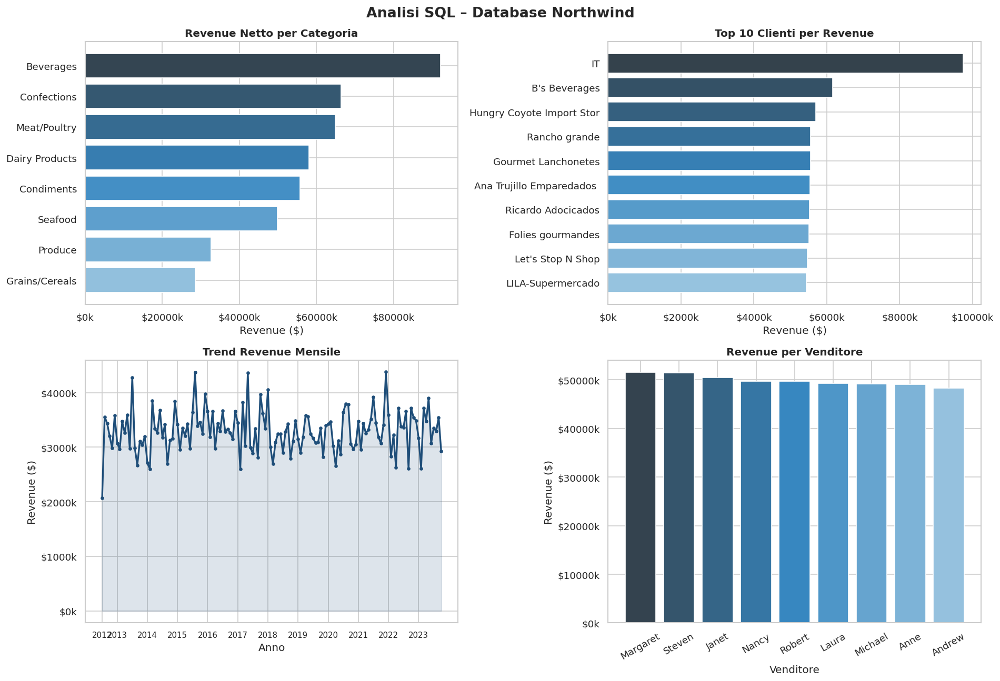

# SQL Northwind Analysis

Advanced SQL queries on the Northwind relational database to extract
business insights on revenue, customers and product performance.

## Technologies
Python, Pandas, SQLite, Matplotlib, Seaborn

## What the analysis covers
- Revenue by product category
- Top 10 customers by revenue
- Monthly revenue trend
- Sales performance by employee
- Critical stock levels

## Output

